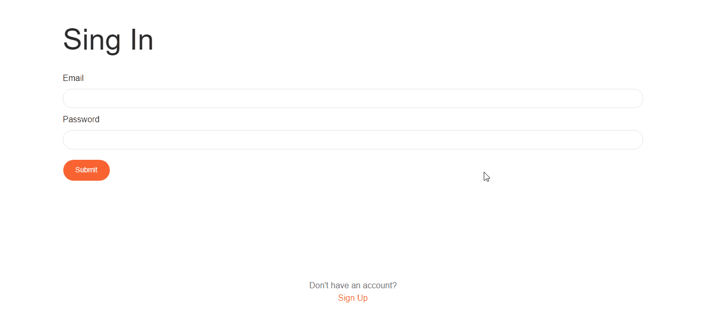
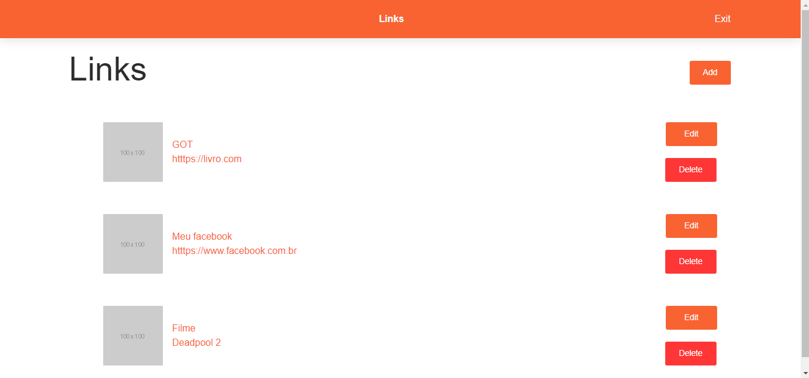

<h1 align="center">🔗Links</h1>

Links é uma repositório de <em>links</em>, desenvolvido com React no Front-End e Nodejs e MySQL no Back-End. A aplicação foi feita em uma maratona JS, com intuito de aprendizado.

 
<h1 align="center"></h1>
 
- <h2>CRUD:</h2>

Devido ao CRUD no Back-End, é possível criar, editar e deletar <em>links</em> do repositório.
Também é possível criar e deletar uma conta na aplicação, permitindo que contas diferentes, possuam repósitórios diferentes. 

 
- <h2>Token:</h2>

O Back-End gera um <em>token</em> toda vez que um <em>login</em> é feito, assim no Front-End, com a utilização do Redux, é possível que cada <em>login</em> feito possua tempo de validade. 

 
<h1 align="center"></h1>